# AlgorithmZone

## Table of Contents
* [Goals](#goals)
* [Technologies Used](#technologies-used)
* [Features](#features)
* [Screenshots](#screenshots)
<!---* [Authors](#authors) -->

## Goals
The objective was to create a system where Computer Science students can learn the processes of fundamental Algorithms & Data Structures with the help of visualizations.

## Technologies Used

    

## Features.
* Users can understand the processes of different algorithms with animations.
* The Algorithms & Data Structures are:   Searching: **Binary search, linear search**   Data Structures: **Stack, queue**   Bit manipulations: **AND, OR, XOR**.
* Users can read the text of how the algorithms or data structures work.
* Time complexity & Psuedocodes provided.

## Screenshots

> #### Stack 

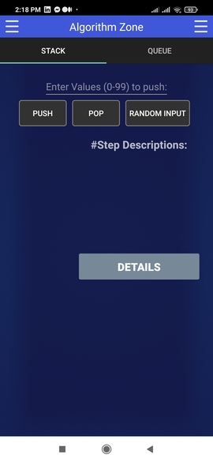    
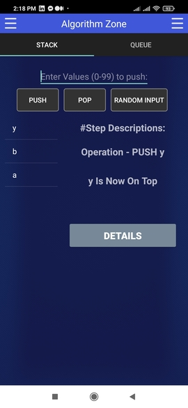  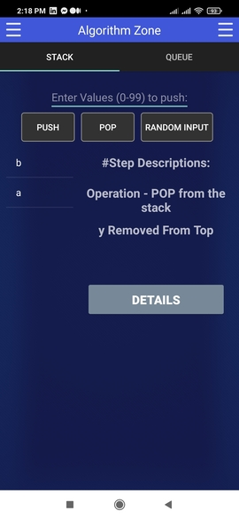  
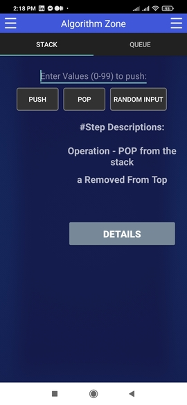 | 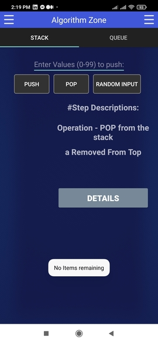

-----------------------------------------------

> #### Bubble Sort 

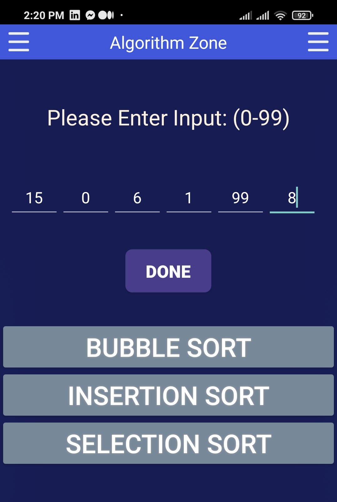 | 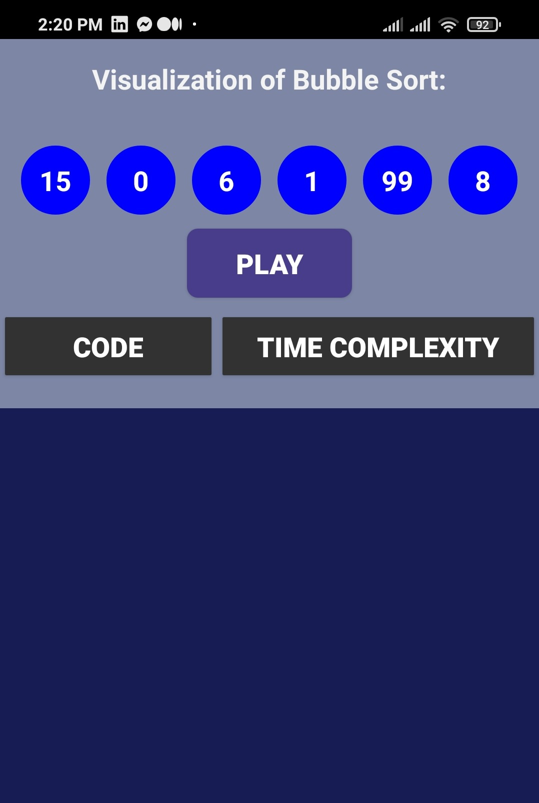  
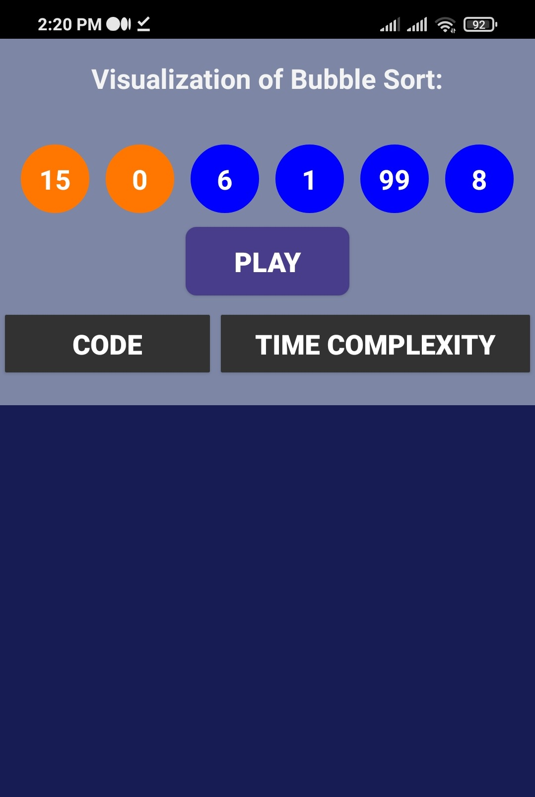 | 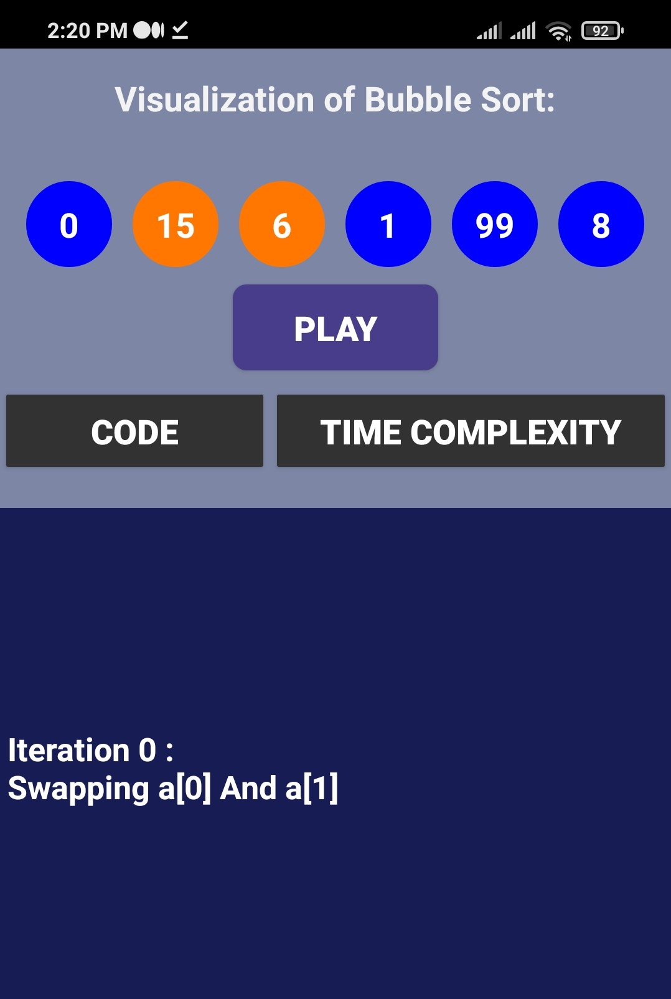  
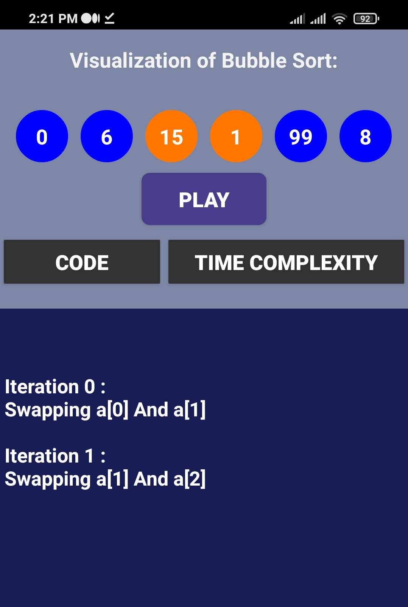 | 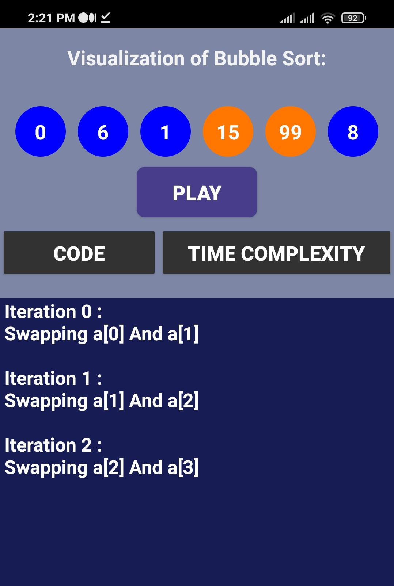  
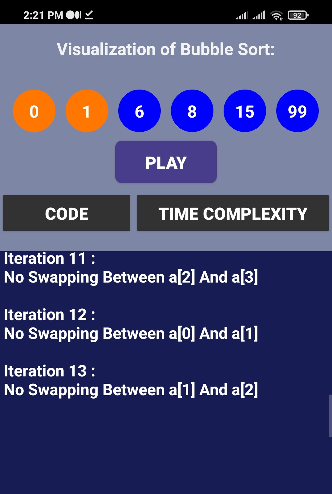 | 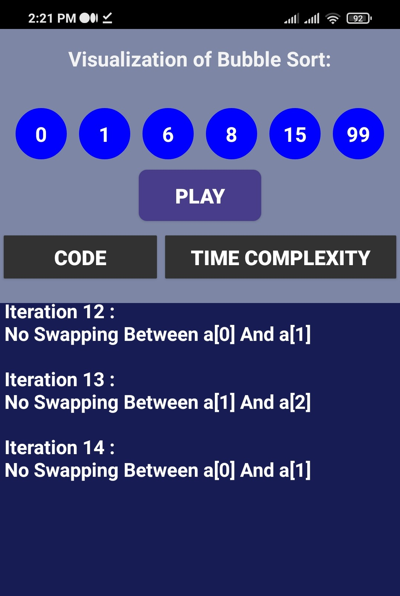 

-----------------------------------------------

> ##### XOR - Operation

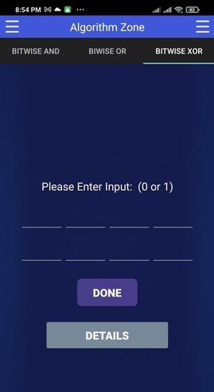 |   
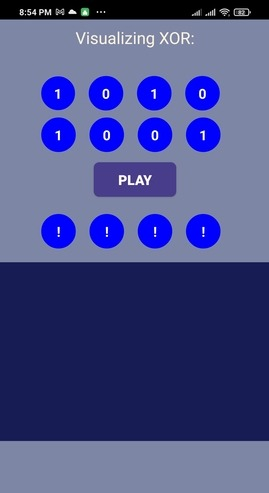 | 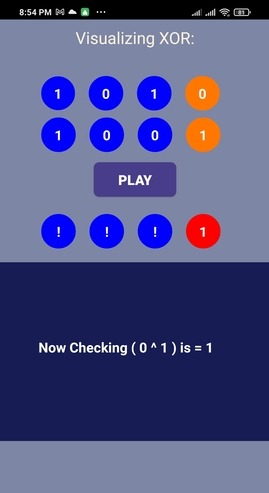  
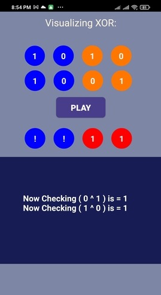 | 

-----------------------------------------------

> ##### Linear Search

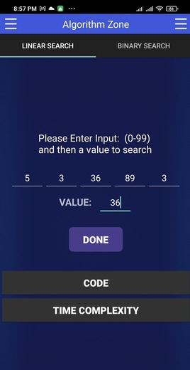 | 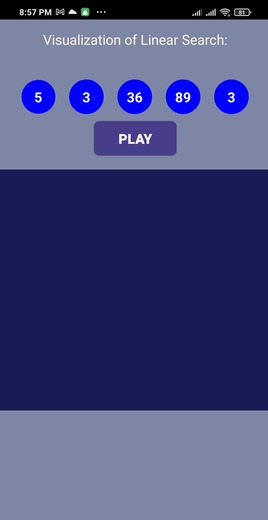  
 | 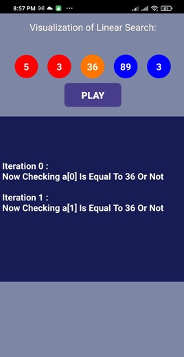  
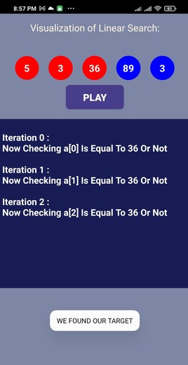 | 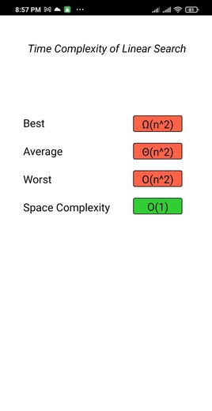

------------------------------------------------

> ##### Binary Search

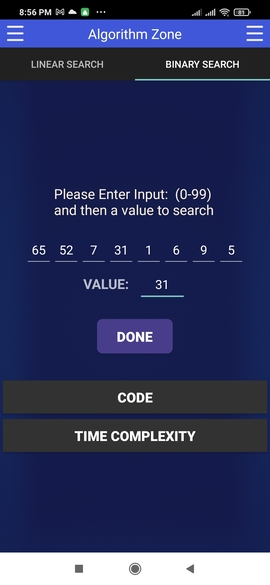 | 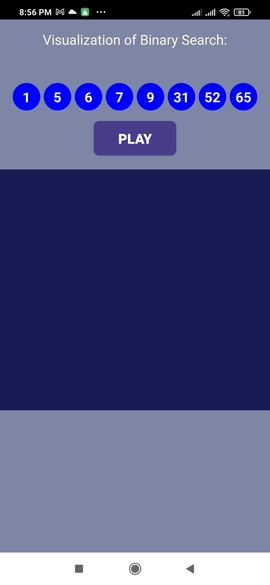  
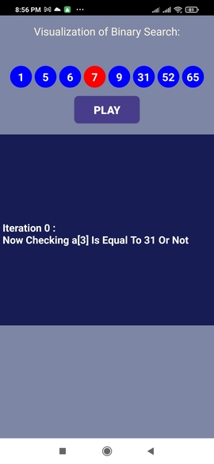 | 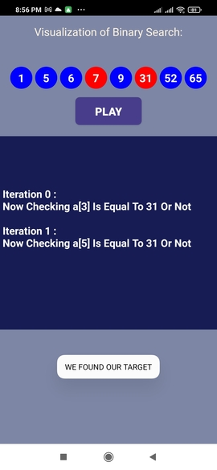  
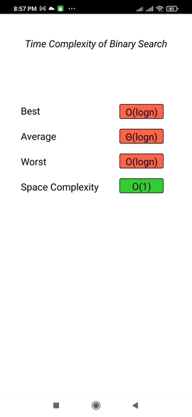 

-----------------------------------------------
