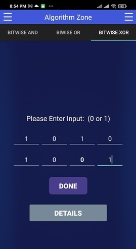

# AlgorithmZone

> This project is the first attempt to implement an academic programming platform system on this model.   Its aims are: 
- Create a system where teachers can create sessions.
- Students can enroll in those sessions.
- Student can submit their assignments/lab tasks.
- Make a checker which will check the user's output of code against valid output and provide a verdict.
- Should have a mechanism to evaluate the submitted solutions against the underlying test cases and generate verdict.
- Make a ACL (Access Control List) for both users and admins.
- A blog where users (teachers) and admins can share their suggestions on any particular topic.

## Table of Contents
* [Goals](#goals)
* [Technologies Used](#technologies-used)
* [Features](#features)
* [Screenshots](#screenshots)
* [Authors](#authors)

## Goals
Our goal was to create an automated system for our university CSE students where they could submit their programming-related assignments without any hassle. Furthermore, the university's competitive programming coach can track the activities of current contestants and create practice programming problems and arrange regular contests for them.

## Technologies Used
- Laravel
- GNU Toolkit [To compile C/C++]
- JDK [To compile Java]
- XAMPP
- NPM
- Composer
- Bootstrap
- Javascript
- JQuery

## Features
- Teachers can create sessions.
- The user can participate in the session.
- Admin has the authority to rejudge submissions.
- The user can view their current standing.
- The user can view the contest list. 
- Users can create, edit, and update their profiles/biographies.
- Access Control List, which distinguishes between users, administrators, and super administrators.
- A user's profile, including personal information and submission history, should be retrievable.
- Each question does have hidden test cases.
- A mechanism to evaluate submitted solutions against the underlying test cases and generate a verdict. 
- The user can inspect his or her own submission code as well as the submissions of others. 

## Screenshots

> #### Stack 

 | 
 |  
 | 

-----------------------------------------------

> #### Bubble Sort 

 |  
 |  
 | 
 |  

-----------------------------------------------

> ##### XOR - Operation

 |  
 |  
 | 

-----------------------------------------------

> ##### Linear Search

 |  
 |  
 | 

------------------------------------------------

> ##### Binary Search

 |  
 |  
 

## Authors
